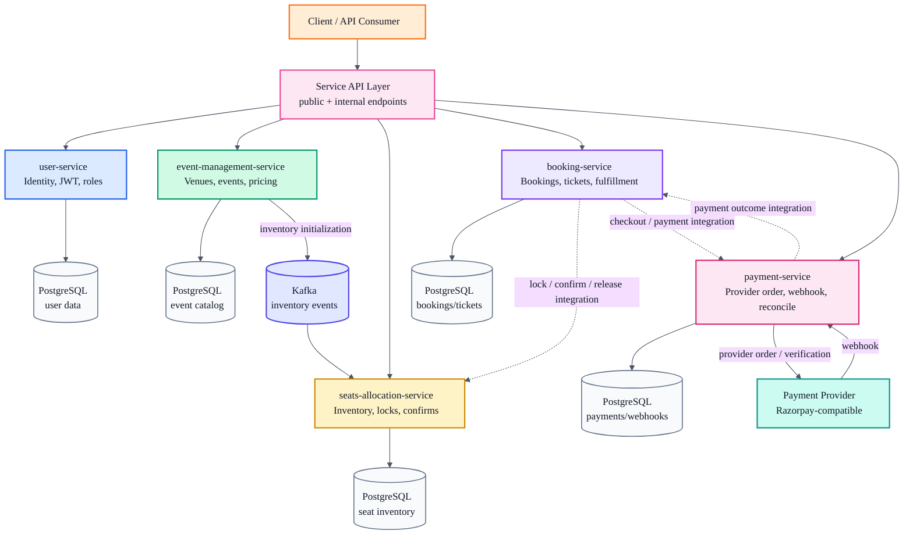

# Ticketmaster-Style Backend Platform

This repository is the portfolio entry point for a Ticketmaster-style event ticketing backend built around Spring Boot microservices, Kafka, PostgreSQL, Docker, and AWS deployment notes.

The project models the backend concerns behind an event booking platform: user identity, venue and event management, seat inventory, seat locking, checkout, payment lifecycle, booking finalization, and ticket issuance.

It is intentionally split into independently deployable services so the architecture can show service ownership, consistency boundaries, idempotency, asynchronous messaging, and operational recovery paths.

## Architecture Overview



## Service Map

| Service | Responsibility | Repository |
| --- | --- | --- |
| User Service | Registration, login, refresh tokens, profile APIs, admin user management, JWT issuance | [AbhinavMantri/user-service](https://github.com/AbhinavMantri/user-service) |
| Event Management Service | Venue management, event creation, event publishing, pricing, inventory initialization events | [AbhinavMantri/event-management-service](https://github.com/AbhinavMantri/event-management-service) |
| Seats Allocation Service | Event seat inventory, availability reads, seat locking, confirmation, release, Kafka inventory consumers | [AbhinavMantri/seats-allocation-service](https://github.com/AbhinavMantri/seats-allocation-service) |
| Booking Service | Booking finalization, booking items, ticket issuance, booking history, ticket scan APIs | [AbhinavMantri/booking-service](https://github.com/AbhinavMantri/booking-service) |
| Payment Service | Payment records, provider order creation, signature verification, webhook ingestion, reconciliation hooks | [AbhinavMantri/payment-service](https://github.com/AbhinavMantri/payment-service) |

## Core Workflows

### Event And Inventory Setup

1. An organiser creates a venue, sections, and seats in `event-management-service`.
2. The organiser creates an event, configures pricing, initializes inventory, and publishes the event.
3. Inventory initialization is emitted through Kafka.
4. `seats-allocation-service` consumes the inventory event and creates event-level seat inventory.

### Seat Lock Before Payment

1. A customer selects seats for a published event.
2. Checkout locks the selected seats before payment starts.
3. Locked seats are temporarily unavailable to other customers.
4. Payment success confirms the seats; payment failure or expiry releases them.

This design keeps the critical consistency boundary around seat state explicit instead of relying on payment success alone.

### Payment And Booking Fulfillment

1. `payment-service` creates a local payment record and provider order.
2. Provider callbacks/webhooks are verified and deduplicated.
3. Successful payment should trigger booking finalization and ticket issuance.
4. `booking-service` exposes an idempotent internal finalize API that creates bookings, booking items, and tickets.

The service READMEs call out current implementation status. Dashed lines in the architecture diagram represent integration boundaries that are partially implemented or need production hardening.

## Engineering Themes Demonstrated

- Service boundaries around identity, catalog, seat inventory, booking, and payment.
- PostgreSQL-backed service-owned persistence instead of shared database ownership.
- Kafka-based inventory propagation between event management and seat allocation.
- Lock-before-pay flow to reduce double-booking risk.
- Idempotency in checkout, payment, and booking finalization paths.
- Provider webhook deduplication and signature verification.
- Reconciliation-oriented payment state handling.
- Docker and AWS CodeBuild/ECR/ECS deployment contracts per service.
- Explicit production-readiness notes instead of hiding incomplete integration work.

## Included In This Repository

- [kafka/docker-compose.yml](kafka/docker-compose.yml): shared local Kafka infrastructure.
- [AWS_CICD_DEPLOYMENT.md](AWS_CICD_DEPLOYMENT.md): AWS CodeBuild, ECR, and ECS deployment frame.
- [CAPSTONE_NOTES.md](CAPSTONE_NOTES.md): service responsibilities and end-to-end platform notes.
- [Ticketmaster_Project_Report.md](Ticketmaster_Project_Report.md): capstone project report.
- [Ticketmaster_Project_Report_Strict_Format.md](Ticketmaster_Project_Report_Strict_Format.md): report in strict submission format.

## Local Infrastructure

Start the shared Kafka broker:

```bash
docker compose -f kafka/docker-compose.yml up -d
```

Each service owns its own local configuration, database setup, APIs, tests, Dockerfile, and deployment notes. Start from the service README for service-specific instructions.

## Deployment Model

Each microservice repository contains:

- `Dockerfile`
- `buildspec.yml`
- `docs/aws-codebuild.md`

The intended AWS flow is:

1. CodeBuild verifies the service with Maven.
2. CodeBuild builds the Docker image.
3. CodeBuild pushes the image to Amazon ECR.
4. CodePipeline or CodeBuild deploys the image to the corresponding ECS service.

See [AWS_CICD_DEPLOYMENT.md](AWS_CICD_DEPLOYMENT.md) for the deployment contract and required AWS variables.

## Production Hardening Roadmap

The project is a backend architecture portfolio project, not a commercial ticketing system. The next production-hardening steps would be:

- Add an API gateway or edge layer for routing, auth propagation, rate limits, and request tracing.
- Complete payment-to-booking orchestration so provider success reliably confirms seats and finalizes bookings.
- Move pricing authority into a clear contract between event, seats, booking, and payment services.
- Add retry policies, dead-letter topics, and replay tooling around Kafka consumers.
- Add distributed tracing, service-level metrics, and operational dashboards.
- Add contract tests across service boundaries and end-to-end tests for success, timeout, duplicate webhook, and failure paths.
- Externalize secrets and infrastructure through a managed secrets store and infrastructure-as-code.

## Portfolio Note

This repo is designed to make the system architecture easy to evaluate from one place. The individual service repositories show the implementation details; this repository explains how the pieces fit together and where the important reliability and consistency boundaries are.
