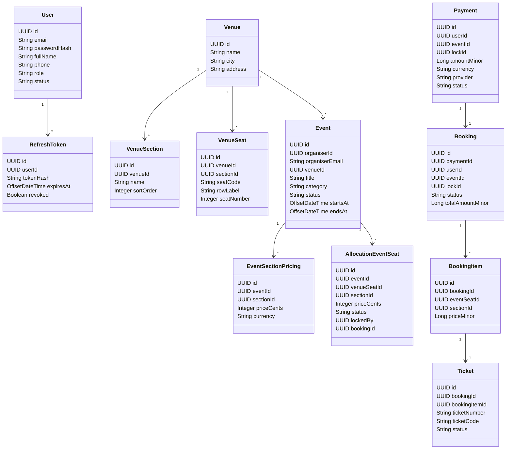
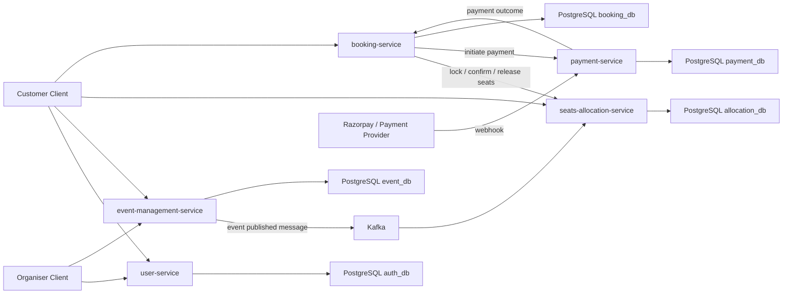
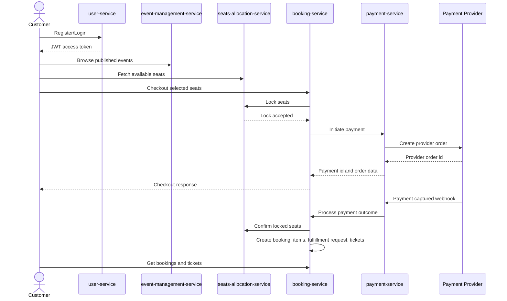
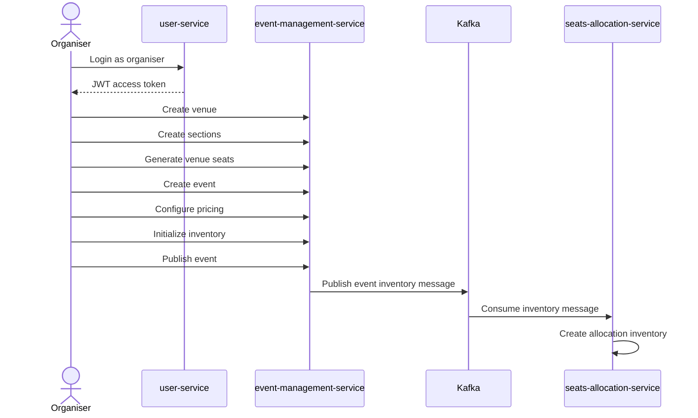

# Ticketmaster Capstone Project Report

Backend Specialization

Project: Ticketmaster Inspired Event Ticketing Platform

Author: Abhinav Mantri

Date: April 19, 2026

---

## List of Tables

| Table No. | Title |
|---|---|
| 1 | Microservice Responsibility Matrix |
| 2 | Functional Requirements |
| 3 | Non-Functional Requirements |
| 4 | Database Schema Summary |
| 5 | Core API Summary |
| 6 | Technologies Used |
| 7 | End-to-End Validation Result |

## List of Figures

| Figure No. | Title |
|---|---|
| 1 | High-Level Microservice Architecture |
| 2 | Customer Booking Sequence |
| 3 | Organiser Event Setup Sequence |
| 4 | Core Domain Class Diagram |
| 5 | Database Relationship Overview |

---

# Applied Software Project

## Abstract

The Ticketmaster Capstone Project is a backend-focused event ticketing platform inspired by real-world ticket booking systems. The application is designed as a set of Spring Boot microservices that together support user authentication, organiser event setup, venue and seat management, seat inventory allocation, checkout orchestration, payment processing, booking confirmation, and ticket issuance.

The platform uses PostgreSQL for service-owned persistence and Kafka for asynchronous event inventory propagation between the event-management and seats-allocation services. The customer purchase flow follows a lock-before-pay design to reduce double booking risk. Seats are locked during checkout, payment is initiated through the payment service, successful payment webhooks trigger booking finalization, and confirmed bookings issue tickets.

The final end-to-end validation confirmed that a customer can register, select seats for a published event, complete payment through a Razorpay-compatible stub, receive a confirmed booking, and retrieve issued tickets.

## Project Description

The system solves the problem of managing event ticket sales across multiple bounded contexts. A single monolithic service would make ownership of user identity, event catalog, seat state, payment lifecycle, and ticket fulfillment difficult to maintain. This project separates those responsibilities into dedicated services with clear data ownership.

The backend consists of five main services:

| Service | Responsibility |
|---|---|
| user-service | User registration, login, refresh token handling, profile APIs, admin user management, JWT issuance |
| event-management-service | Venue creation, section and seat generation, event creation, pricing, inventory initialization, event publishing |
| seats-allocation-service | Event seat inventory, availability reads, seat locking, seat confirmation, seat release, idempotency |
| booking-service | Checkout orchestration, booking finalization, booking items, ticket issuance, ticket retrieval, fulfillment request tracking |
| payment-service | Payment initiation, provider order creation, webhook processing, payment state management, booking confirmation callback |

Supporting infrastructure:

| Component | Purpose |
|---|---|
| PostgreSQL | Persistent storage per service schema/database |
| Kafka | Asynchronous event inventory messaging |
| Razorpay stub | Local payment provider simulation for E2E validation |
| Maven | Java build and dependency management |

The project focuses on the following user journeys:

1. Customer registration and login.
2. Organiser venue and event setup.
3. Event pricing and inventory initialization.
4. Event publishing and inventory propagation.
5. Customer seat selection and checkout.
6. Seat lock and payment initiation.
7. Payment webhook processing.
8. Booking confirmation and ticket issuance.
9. Customer booking and ticket retrieval.

## Requirement Gathering

### Functional Requirements

| ID | Requirement | Implemented By |
|---|---|---|
| FR-01 | User should be able to register and login | user-service |
| FR-02 | User should receive JWT access token and refresh token | user-service |
| FR-03 | Admin should be able to list users and update role/status | user-service |
| FR-04 | Organiser should be able to create venues | event-management-service |
| FR-05 | Organiser should be able to create venue sections and seats | event-management-service |
| FR-06 | Organiser should be able to create events | event-management-service |
| FR-07 | Organiser should configure section-level pricing | event-management-service |
| FR-08 | Organiser should initialize inventory for an event | event-management-service |
| FR-09 | Published event should be available for customer discovery | event-management-service |
| FR-10 | Event inventory should be propagated to seat allocation | Kafka, seats-allocation-service |
| FR-11 | Customer should be able to view available seats | seats-allocation-service |
| FR-12 | Customer checkout should lock selected seats | booking-service, seats-allocation-service |
| FR-13 | Checkout should initiate payment | booking-service, payment-service |
| FR-14 | Payment webhook should update payment status | payment-service |
| FR-15 | Successful payment should confirm seats | payment-service, booking-service, seats-allocation-service |
| FR-16 | Successful payment should create booking and booking items | booking-service |
| FR-17 | Successful booking should issue tickets | booking-service |
| FR-18 | Customer should be able to retrieve bookings and tickets | booking-service |
| FR-19 | Fulfillment requests should be tracked for booking finalization | booking-service |

### Non-Functional Requirements

| Requirement | Design Decision |
|---|---|
| Scalability | Service boundaries split high-traffic catalog, seat allocation, payment, and booking responsibilities |
| Reliability | Idempotency keys are used in checkout/payment and allocation flows |
| Consistency | Lock-before-pay prevents multiple customers from buying the same seats |
| Security | JWT authentication protects customer/organiser/admin APIs |
| Data ownership | Each service owns its own schema/database tables |
| Observability | Services log request IDs and important state transitions |
| Extensibility | Payment provider integration is abstracted behind payment-service |
| Testability | Local E2E flow validates service integration with Kafka and PostgreSQL |

### Actors

| Actor | Description |
|---|---|
| Customer | Browses events, selects seats, completes payment, views tickets |
| Organiser | Creates venues, sections, seats, events, pricing, and publishes events |
| Admin | Manages platform users and roles |
| Payment Provider | Sends payment status callbacks through webhook |

## Class Diagrams

The project is implemented as multiple bounded contexts. The following simplified class diagram shows the main domain classes across the platform.

## Database Schema Design

The project uses separate schemas/databases to keep service ownership clear. Cross-service references are stored as UUIDs without foreign keys across service boundaries.

### Database Schema Summary

| Service | Database/Schema | Main Tables |
|---|---|---|
| user-service | `user_service.auth_db` | `users`, `refresh_tokens` |
| event-management-service | `event_db` | `venues`, `venue_sections`, `venue_seats`, `events`, `event_section_pricing`, `event_seats` |
| seats-allocation-service | `allocation_db` | `event_inventory_context`, `event_seats`, `allocation_idempotency` |
| booking-service | `booking_db` | `bookings`, `booking_items`, `tickets`, `booking_fulfillment_requests` |
| payment-service | `payment_db` | `payments`, `payment_idempotency`, `processed_webhooks` |

### User Service Schema

The user service owns user accounts and refresh tokens. Passwords are stored as hashes and refresh tokens are stored as hashes rather than raw tokens.

Important constraints:

- `users.email` is unique.
- User role is constrained to `CUSTOMER`, `ORGANIZER`, `ADMIN`, and `GATE_AGENT`.
- User status is constrained to `ACTIVE` or `DISABLED`.
- Refresh token hashes are unique.

### Event Management Schema

The event service owns venue and event setup data.

Important constraints:

- Venue name is unique per city using a case-insensitive index.
- Venue section name is unique per venue.
- Venue seat code is unique per venue.
- Event status is constrained to `DRAFT`, `PUBLISHED`, or `CANCELLED`.
- Event pricing is unique per event and section.

### Seats Allocation Schema

The allocation service owns runtime seat state for each event.

Important constraints:

- One `event_inventory_context` row exists per event.
- One allocation seat exists per event and venue seat.
- Seat status is constrained to `AVAILABLE`, `LOCKED`, or `BOOKED`.
- Lock fields are required only when seat status is `LOCKED`.
- Booking fields are required only when seat status is `BOOKED`.
- `allocation_idempotency` prevents duplicate mutation effects.

### Booking Service Schema

The booking service owns confirmed bookings and issued tickets.

Important constraints:

- `bookings.payment_id` is unique.
- `booking_items` are unique per booking and event seat.
- Each booking item can have one ticket.
- Ticket number and ticket code are unique.
- `booking_fulfillment_requests.payment_id` is unique for retry-safe finalization tracking.

### Payment Service Schema

The payment service owns payment lifecycle records.

Important constraints:

- Payment status is constrained to known lifecycle values.
- Provider order ID is unique per provider when present.
- Provider payment ID is unique per provider when present.
- Payment idempotency is unique per user and idempotency key.
- Processed webhooks are unique per provider and provider event ID.

## Feature Development Process

### High-Level Architecture

### Customer Booking Sequence

### Organiser Event Setup Sequence

### Major Features Implemented

#### Authentication and User Management

- Customer registration.
- Login with JWT access token and refresh token.
- Refresh token persistence using token hash.
- Logout flow.
- Authenticated profile APIs.
- Admin user listing and user role/status updates.

#### Event and Venue Management

- Venue creation.
- Venue section creation.
- Seat generation by row and seat count.
- Event creation by organiser.
- Section-level pricing.
- Inventory initialization.
- Event publishing.
- Public event browsing and detail retrieval.

#### Seat Allocation

- Event inventory consumption from Kafka.
- Seat availability read APIs.
- Lock selected seats during checkout.
- Confirm seats after payment success.
- Release seats for failed or cancelled flows.
- Allocation idempotency records for retry safety.

#### Booking and Ticketing

- Checkout orchestration.
- Seat lock call to allocation service.
- Payment initiation call to payment service.
- Booking finalization after payment success.
- Booking item persistence.
- Ticket issuance.
- Booking retrieval.
- Ticket retrieval and ticket scan API.
- Fulfillment request persistence for finalization tracking.

#### Payment Processing

- Payment record creation.
- Razorpay-compatible provider order creation.
- Idempotency for payment initiation.
- Webhook signature validation.
- Payment status mapping.
- Processed webhook deduplication.
- Booking confirmation callback after successful payment.

### Core API Summary

| Service | API | Purpose |
|---|---|---|
| user-service | `POST /auth/register` | Register customer |
| user-service | `POST /auth/login` | Login and receive tokens |
| user-service | `PATCH /admin/users/{id}/role` | Promote organiser/admin roles |
| event-management-service | `POST /venues` | Create venue |
| event-management-service | `POST /venues/{venueId}/sections` | Create venue section |
| event-management-service | `POST /venues/{venueId}/sections/{sectionId}/seats/generate` | Generate seats |
| event-management-service | `POST /organiser/events` | Create event |
| event-management-service | `POST /organiser/events/{eventId}/pricing` | Configure pricing |
| event-management-service | `POST /organiser/events/{eventId}/inventory/init` | Initialize inventory |
| event-management-service | `POST /organiser/events/{eventId}/publish` | Publish event |
| seats-allocation-service | `GET /events/{eventId}/seats` | Get event seats |
| seats-allocation-service | `POST /internal/seats/{eventId}/locks` | Lock seats |
| seats-allocation-service | `POST /internal/seats/confirm` | Confirm seats |
| booking-service | `POST /bookings/checkout` | Start checkout |
| booking-service | `GET /bookings` | Get customer bookings |
| booking-service | `GET /bookings/{bookingId}/tickets` | Get tickets for booking |
| payment-service | `POST /internal/v1/payments/initiate` | Internal payment initiation |
| payment-service | `POST /internal/v1/payments/webhook` | Process payment webhook |

### End-to-End Validation

The latest E2E validation was executed locally with PostgreSQL, Kafka, and all services running.

| Field | Value |
|---|---|
| Event ID | `1c29ce5a-f7ee-40c5-bce9-f5ee6fa24f38` |
| Payment ID | `b6eb50b4-0e87-43a1-bd3f-cb842cf70ed3` |
| Final Booking ID | `311474ab-c025-46b9-a8a8-72e09daef540` |
| Ticket Count | `2` |
| Ticket Statuses | `ISSUED`, `ISSUED` |
| Webhook Status | `SUCCESS` |
| Webhook Payment Status | `SUCCESS` |
| Fulfillment Requests Created | `1` |

Validation confirmed:

1. Organiser and customer users were created.
2. Organiser created venue, section, seats, event, pricing, inventory, and published event.
3. Kafka delivered event inventory to seats-allocation-service.
4. Customer selected seats and initiated checkout.
5. Seats were locked successfully.
6. Payment was initiated through payment-service.
7. Razorpay-compatible webhook marked payment as successful.
8. Booking-service confirmed seats, finalized booking, created booking fulfillment request, and issued tickets.
9. Customer retrieved booking and tickets.

## Deployment Flow

### Local Deployment Architecture

The project is currently validated in a local development environment.

1. PostgreSQL is started and service databases/schemas are created.
2. Kafka is started using Docker Compose from the `kafka` directory.
3. Services are started with the `dev` Spring profile.
4. Payment provider behavior is simulated using a local Razorpay stub on port `8099`.
5. The E2E script performs organiser setup and customer purchase validation.

### Local Service Ports

| Service | Port |
|---|---|
| user-service | 8080 |
| event-management-service | 8081 |
| booking-service | 8082 |
| seats-allocation-service | 8083 |
| payment-service | 8084 |
| Razorpay stub | 8099 |
| Kafka | 9092 |

### Suggested Run Order

1. PostgreSQL.
2. Kafka.
3. user-service.
4. event-management-service.
5. seats-allocation-service.
6. payment-service.
7. booking-service.
8. Razorpay stub.
9. E2E validation script.

### API Gateway and Service Discovery

The current project does not require an API gateway or microservice discovery service for the capstone E2E flow. Services communicate through configured base URLs in local development. API gateway and service discovery can be added as future architectural improvements for centralized routing, authentication, rate limiting, and dynamic service resolution.

## Technologies Used

| Category | Technology |
|---|---|
| Language | Java 21 |
| Framework | Spring Boot 4 |
| API Layer | Spring Web |
| Persistence | Spring Data JPA, Hibernate |
| Database | PostgreSQL |
| Messaging | Apache Kafka |
| Security | JWT, HMAC-SHA256, BCrypt |
| Payment Integration | Razorpay-compatible provider flow |
| Build Tool | Maven |
| Testing | JUnit, Mockito, Spring Boot Test, live E2E scripts |
| Container Runtime | Docker for Kafka |

## Conclusion

The Ticketmaster Capstone backend implements a realistic event ticketing workflow using a microservice architecture. The system separates identity, event management, seat allocation, booking, and payment responsibilities into independent services with service-owned persistence.

The most important customer flow has been validated end to end. A published event can be created by an organiser, inventory is propagated through Kafka, seats can be selected and locked by a customer, payment can be initiated and completed through webhook processing, seats are confirmed, a booking is finalized, fulfillment is tracked, and tickets are issued.

The system is suitable for capstone demonstration in its current state. Future enhancements can include an API gateway, service discovery, richer frontend integration, distributed tracing, production-grade secrets management, enhanced ticket scan authorization, and automated CI/CD deployment.

## References

1. Spring Boot Documentation: https://spring.io/projects/spring-boot
2. Spring Data JPA Documentation: https://spring.io/projects/spring-data-jpa
3. PostgreSQL Documentation: https://www.postgresql.org/docs/
4. Apache Kafka Documentation: https://kafka.apache.org/documentation/
5. Razorpay API Documentation: https://razorpay.com/docs/api/
6. JWT Introduction: https://jwt.io/introduction
7. Project source code and service documentation in the local workspace:
   - `user-service`
   - `event-management-service`
   - `seats-allocation-service`
   - `booking-service`
   - `payment-service`
