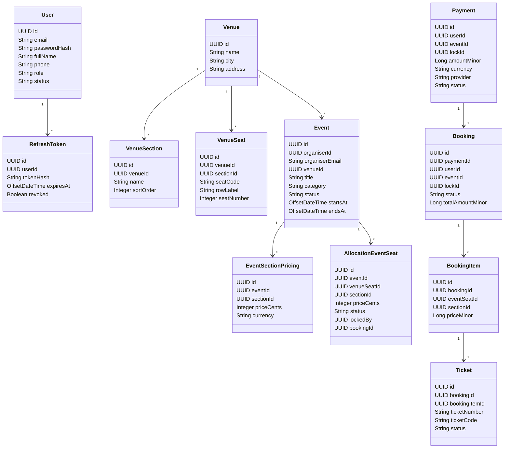
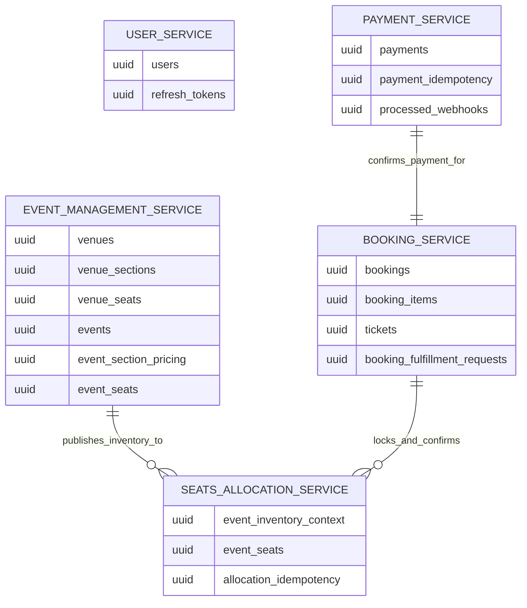
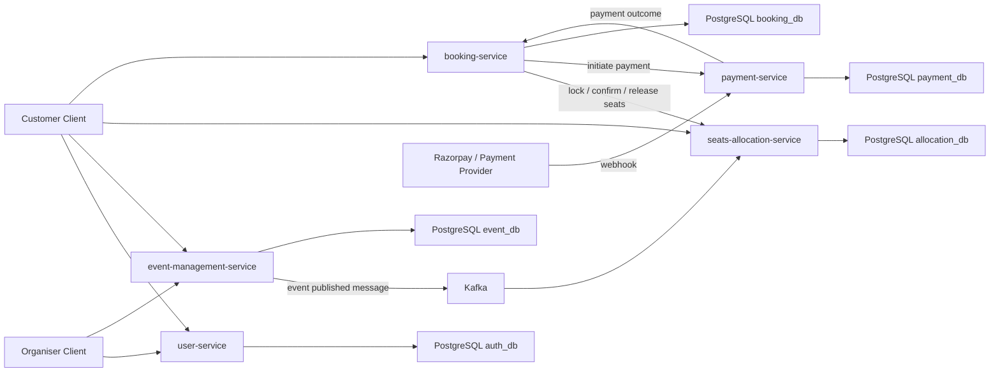
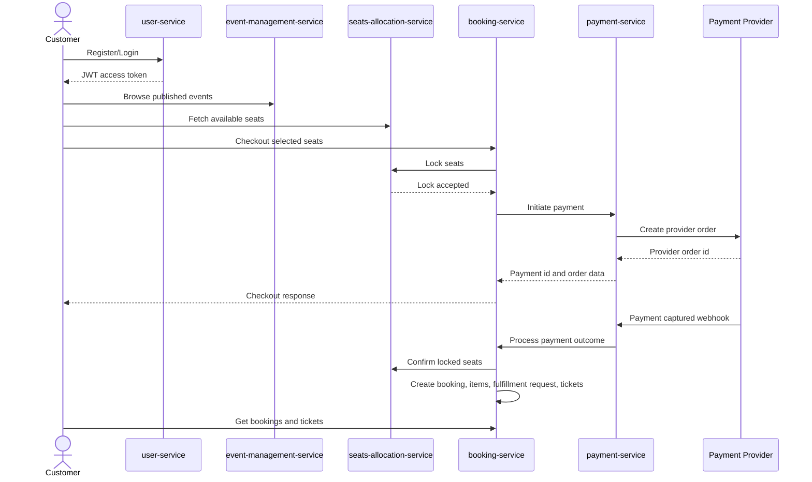
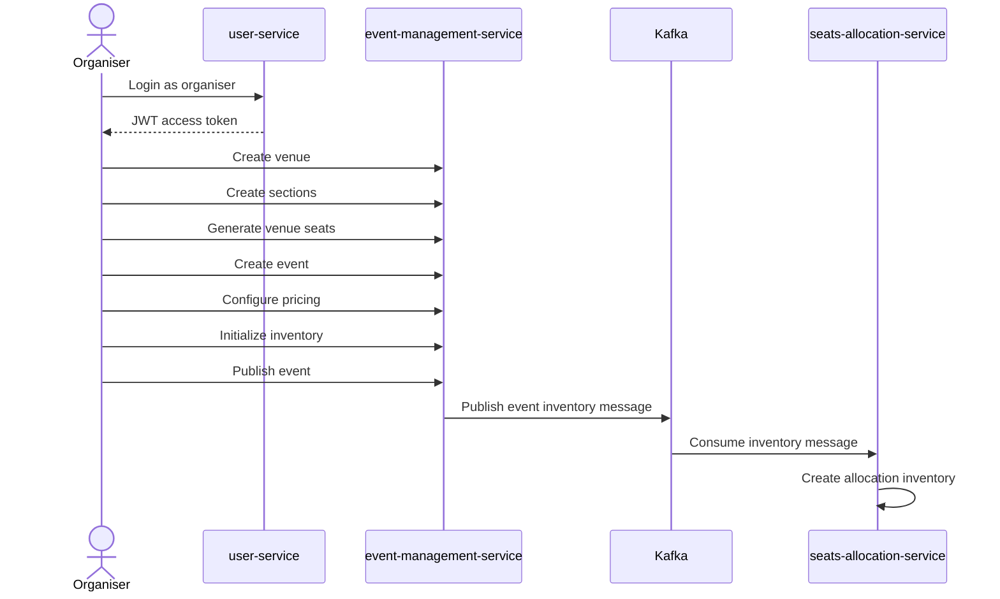
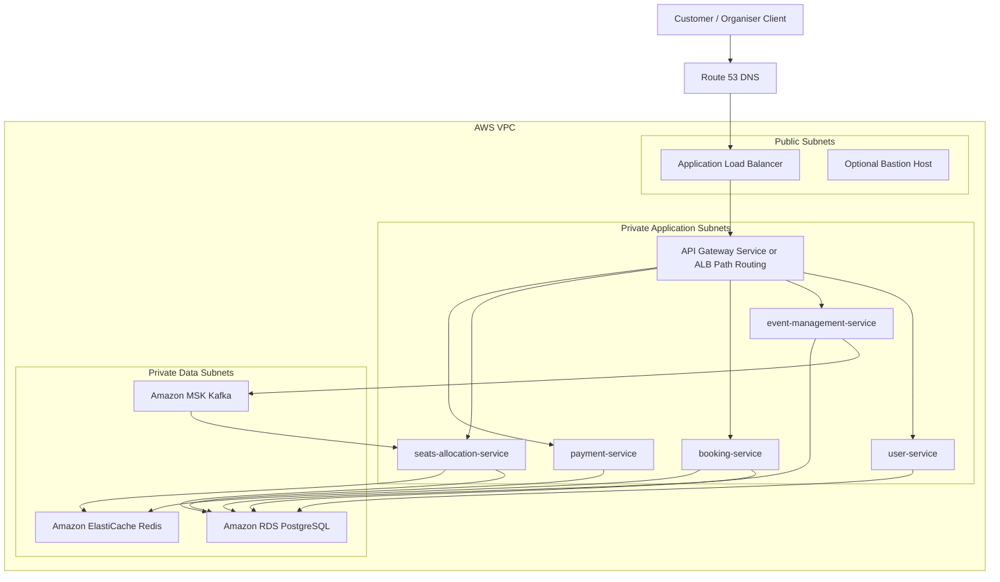

# Applied Software Project Report

By

Abhinav Mantri

A Master's Project Report submitted to Scaler Neovarsity - Woolf in partial fulfillment of the requirements for the degree of Master of Science in Computer Science

April, 2026

Scaler Mentee Email ID: `<Registered Scaler Email ID>`

Thesis Supervisor: Naman Bhalla

Date of Submission: `<DD/MM/YYYY>`

---

<!-- Page Break -->

# Certification

I confirm that I have overseen / reviewed this applied project and, in my judgment, it adheres to the appropriate standards of academic presentation. I believe it satisfactorily meets the criteria, in terms of both quality and breadth, to serve as an applied project report for the attainment of Master of Science in Computer Science degree. This applied project report has been submitted to Woolf and is deemed sufficient to fulfill the prerequisites for the Master of Science in Computer Science degree.

Naman Bhalla

....................

Project Guide / Supervisor

<!-- Page Break -->

# DECLARATION

I confirm that this project report, submitted to fulfill the requirements for the Master of Science in Computer Science degree, completed by me from `<Project Module start date>` to `<Module end date>`, is the result of my own individual endeavor. The project has been made on my own under the guidance of my supervisor with proper acknowledgement and without plagiarism. Any contributions from external sources or individuals, including the use of AI tools, are appropriately acknowledged through citation. By making this declaration, I acknowledge that any violation of this statement constitutes academic misconduct. I understand that such misconduct may lead to expulsion from the program and/or disqualification from receiving the degree.

Abhinav Mantri

`<Signature of the Candidate>`                                                                      

Date: `<XX Month 20XX>`

<!-- Page Break -->

# ACKNOWLEDGMENT

I would like to express my sincere gratitude to my project guide, Scaler instructors, mentors, and the Scaler Neovarsity program team for their guidance throughout the backend specialization and capstone project. Their structured feedback helped me design, implement, debug, and validate the Ticketmaster inspired event ticketing backend as a complete applied software project.

I am also thankful to my family and peers for their support and encouragement during the program. This project helped me apply backend engineering concepts such as microservice boundaries, relational schema design, asynchronous messaging, authentication, payment workflows, booking orchestration, and end-to-end validation in a practical system.

<!-- Page Break -->

# Table of Contents

| Section | Page No. |
|---|---|
| List of Tables | `<page>` |
| List of Figures | `<page>` |
| Applied Software Project | `<page>` |
| Abstract | `<page>` |
| Project Description | `<page>` |
| Requirement Gathering | `<page>` |
| Class Diagrams | `<page>` |
| Database Schema Design | `<page>` |
| Feature Development Process | `<page>` |
| Deployment Flow | `<page>` |
| Technologies Used | `<page>` |
| Conclusion | `<page>` |
| References | `<page>` |

<!-- Page Break -->

# List of Tables

| Table No. | Title | Page No. |
|---|---|---|
| 1.01 | Microservice Responsibility Matrix | `<page>` |
| 1.02 | Supporting Infrastructure Components | `<page>` |
| 1.03 | Functional Requirements | `<page>` |
| 1.04 | Non-Functional Requirements | `<page>` |
| 1.05 | Users and Actors | `<page>` |
| 1.06 | Database Schema Summary | `<page>` |
| 1.07 | Core API Summary | `<page>` |
| 1.08 | End-to-End Validation Result | `<page>` |
| 1.09 | Performance Optimization Summary | `<page>` |
| 1.10 | Local Service Ports | `<page>` |
| 1.11 | AWS Security Group Rules | `<page>` |
| 1.12 | AWS Managed Services Mapping | `<page>` |
| 1.13 | Technologies Used | `<page>` |

<!-- Page Break -->

# List of Figures

| Figure No. | Title | Page No. |
|---|---|---|
| 1.01 | Core Domain Class Diagram | `<page>` |
| 1.02 | Database Relationship Overview | `<page>` |
| 1.03 | High-Level Microservice Architecture | `<page>` |
| 1.04 | Customer Booking Sequence | `<page>` |
| 1.05 | Organiser Event Setup Sequence | `<page>` |
| 1.06 | AWS Deployment Architecture | `<page>` |

---

<!-- Page Break -->

# Applied Software Project

## Abstract

The Ticketmaster Capstone Project is a backend-focused event ticketing platform inspired by real-world ticket booking systems. The application is designed as a set of Spring Boot microservices that together support user authentication, organiser event setup, venue and seat management, seat inventory allocation, checkout orchestration, payment processing, booking confirmation, and ticket issuance.

The platform uses PostgreSQL for service-owned persistence and Kafka for asynchronous event inventory propagation between the event-management and seats-allocation services. The customer purchase flow follows a lock-before-pay design to reduce double booking risk. Seats are locked during checkout, payment is initiated through the payment service, successful payment webhooks trigger booking finalization, and confirmed bookings issue tickets.

The final end-to-end validation confirmed that a customer can register, select seats for a published event, complete payment through a Razorpay-compatible stub, receive a confirmed booking, and retrieve issued tickets.

<!-- Page Break -->

## Project Description

The system solves the problem of managing event ticket sales across multiple bounded contexts. A single monolithic service would make ownership of user identity, event catalog, seat state, payment lifecycle, and ticket fulfillment difficult to maintain. This project separates those responsibilities into dedicated services with clear data ownership.

The backend consists of five main services:

Table 1.01: Microservice Responsibility Matrix

| Service | Responsibility |
|---|---|
| user-service | User registration, login, refresh token handling, profile APIs, admin user management, JWT issuance |
| event-management-service | Venue creation, section and seat generation, event creation, pricing, inventory initialization, event publishing |
| seats-allocation-service | Event seat inventory, availability reads, seat locking, seat confirmation, seat release, idempotency |
| booking-service | Checkout orchestration, booking finalization, booking items, ticket issuance, ticket retrieval, fulfillment request tracking |
| payment-service | Payment initiation, provider order creation, webhook processing, payment state management, booking confirmation callback |

Supporting infrastructure:

Table 1.02: Supporting Infrastructure Components

| Component | Purpose |
|---|---|
| PostgreSQL | Persistent storage per service schema/database |
| Kafka | Asynchronous event inventory messaging |
| Razorpay stub | Local payment provider simulation for E2E validation |
| Maven | Java build and dependency management |

The project focuses on the following user journeys:

1. Customer registration and login.
2. Organiser venue and event setup.
3. Event pricing and inventory initialization.
4. Event publishing and inventory propagation.
5. Customer seat selection and checkout.
6. Seat lock and payment initiation.
7. Payment webhook processing.
8. Booking confirmation and ticket issuance.
9. Customer booking and ticket retrieval.

<!-- Page Break -->

## Requirement Gathering

### Functional Requirements

Table 1.03: Functional Requirements

| ID | Requirement | Implemented By |
|---|---|---|
| FR-01 | User should be able to register and login | user-service |
| FR-02 | User should receive JWT access token and refresh token | user-service |
| FR-03 | Admin should be able to list users and update role/status | user-service |
| FR-04 | Organiser should be able to create venues | event-management-service |
| FR-05 | Organiser should be able to create venue sections and seats | event-management-service |
| FR-06 | Organiser should be able to create events | event-management-service |
| FR-07 | Organiser should configure section-level pricing | event-management-service |
| FR-08 | Organiser should initialize inventory for an event | event-management-service |
| FR-09 | Published event should be available for customer discovery | event-management-service |
| FR-10 | Event inventory should be propagated to seat allocation | Kafka, seats-allocation-service |
| FR-11 | Customer should be able to view available seats | seats-allocation-service |
| FR-12 | Customer checkout should lock selected seats | booking-service, seats-allocation-service |
| FR-13 | Checkout should initiate payment | booking-service, payment-service |
| FR-14 | Payment webhook should update payment status | payment-service |
| FR-15 | Successful payment should confirm seats | payment-service, booking-service, seats-allocation-service |
| FR-16 | Successful payment should create booking and booking items | booking-service |
| FR-17 | Successful booking should issue tickets | booking-service |
| FR-18 | Customer should be able to retrieve bookings and tickets | booking-service |
| FR-19 | Fulfillment requests should be tracked for booking finalization | booking-service |

### Non-Functional Requirements

Table 1.04: Non-Functional Requirements

| Requirement | Design Decision |
|---|---|
| Scalability | Service boundaries split high-traffic catalog, seat allocation, payment, and booking responsibilities |
| Reliability | Idempotency keys are used in checkout/payment and allocation flows |
| Consistency | Lock-before-pay prevents multiple customers from buying the same seats |
| Security | JWT authentication protects customer/organiser/admin APIs |
| Data ownership | Each service owns its own schema/database tables |
| Observability | Services log request IDs and important state transitions |
| Extensibility | Payment provider integration is abstracted behind payment-service |
| Testability | Local E2E flow validates service integration with Kafka and PostgreSQL |

### Actors

Table 1.05: Users and Actors

| Actor | Description |
|---|---|
| Customer | Browses events, selects seats, completes payment, views tickets |
| Organiser | Creates venues, sections, seats, events, pricing, and publishes events |
| Admin | Manages platform users and roles |
| Payment Provider | Sends payment status callbacks through webhook |

<!-- Page Break -->

## Class Diagrams

The project is implemented as multiple bounded contexts. The following simplified class diagram shows the main domain classes across the platform.

Figure 1.01: Core Domain Class Diagram

<!-- Page Break -->

## Database Schema Design

The project uses separate schemas/databases to keep service ownership clear. Cross-service references are stored as UUIDs without foreign keys across service boundaries.

Figure 1.02: Database Relationship Overview

### Database Schema Summary

Table 1.06: Database Schema Summary

| Service | Database/Schema | Main Tables |
|---|---|---|
| user-service | `user_service.auth_db` | `users`, `refresh_tokens` |
| event-management-service | `event_db` | `venues`, `venue_sections`, `venue_seats`, `events`, `event_section_pricing`, `event_seats` |
| seats-allocation-service | `allocation_db` | `event_inventory_context`, `event_seats`, `allocation_idempotency` |
| booking-service | `booking_db` | `bookings`, `booking_items`, `tickets`, `booking_fulfillment_requests` |
| payment-service | `payment_db` | `payments`, `payment_idempotency`, `processed_webhooks` |

### User Service Schema

The user service owns user accounts and refresh tokens. Passwords are stored as hashes and refresh tokens are stored as hashes rather than raw tokens.

Important constraints:

- `users.email` is unique.
- User role is constrained to `CUSTOMER`, `ORGANIZER`, `ADMIN`, and `GATE_AGENT`.
- User status is constrained to `ACTIVE` or `DISABLED`.
- Refresh token hashes are unique.

### Event Management Schema

The event service owns venue and event setup data.

Important constraints:

- Venue name is unique per city using a case-insensitive index.
- Venue section name is unique per venue.
- Venue seat code is unique per venue.
- Event status is constrained to `DRAFT`, `PUBLISHED`, or `CANCELLED`.
- Event pricing is unique per event and section.

### Seats Allocation Schema

The allocation service owns runtime seat state for each event.

Important constraints:

- One `event_inventory_context` row exists per event.
- One allocation seat exists per event and venue seat.
- Seat status is constrained to `AVAILABLE`, `LOCKED`, or `BOOKED`.
- Lock fields are required only when seat status is `LOCKED`.
- Booking fields are required only when seat status is `BOOKED`.
- `allocation_idempotency` prevents duplicate mutation effects.

### Booking Service Schema

The booking service owns confirmed bookings and issued tickets.

Important constraints:

- `bookings.payment_id` is unique.
- `booking_items` are unique per booking and event seat.
- Each booking item can have one ticket.
- Ticket number and ticket code are unique.
- `booking_fulfillment_requests.payment_id` is unique for retry-safe finalization tracking.

### Payment Service Schema

The payment service owns payment lifecycle records.

Important constraints:

- Payment status is constrained to known lifecycle values.
- Provider order ID is unique per provider when present.
- Provider payment ID is unique per provider when present.
- Payment idempotency is unique per user and idempotency key.
- Processed webhooks are unique per provider and provider event ID.

<!-- Page Break -->

## Feature Development Process

### High-Level Architecture

Figure 1.03: High-Level Microservice Architecture

### Customer Booking Sequence

Figure 1.04: Customer Booking Sequence

### Organiser Event Setup Sequence

Figure 1.05: Organiser Event Setup Sequence

### Major Features Implemented

#### Authentication and User Management

- Customer registration.
- Login with JWT access token and refresh token.
- Refresh token persistence using token hash.
- Logout flow.
- Authenticated profile APIs.
- Admin user listing and user role/status updates.

#### Event and Venue Management

- Venue creation.
- Venue section creation.
- Seat generation by row and seat count.
- Event creation by organiser.
- Section-level pricing.
- Inventory initialization.
- Event publishing.
- Public event browsing and detail retrieval.

#### Seat Allocation

- Event inventory consumption from Kafka.
- Seat availability read APIs.
- Lock selected seats during checkout.
- Confirm seats after payment success.
- Release seats for failed or cancelled flows.
- Allocation idempotency records for retry safety.

#### Booking and Ticketing

- Checkout orchestration.
- Seat lock call to allocation service.
- Payment initiation call to payment service.
- Booking finalization after payment success.
- Booking item persistence.
- Ticket issuance.
- Booking retrieval.
- Ticket retrieval and ticket scan API.
- Fulfillment request persistence for finalization tracking.

#### Payment Processing

- Payment record creation.
- Razorpay-compatible provider order creation.
- Idempotency for payment initiation.
- Webhook signature validation.
- Payment status mapping.
- Processed webhook deduplication.
- Booking confirmation callback after successful payment.

### Core API Summary

Table 1.07: Core API Summary

| Service | API | Purpose |
|---|---|---|
| user-service | `POST /auth/register` | Register customer |
| user-service | `POST /auth/login` | Login and receive tokens |
| user-service | `PATCH /admin/users/{id}/role` | Promote organiser/admin roles |
| event-management-service | `POST /venues` | Create venue |
| event-management-service | `POST /venues/{venueId}/sections` | Create venue section |
| event-management-service | `POST /venues/{venueId}/sections/{sectionId}/seats/generate` | Generate seats |
| event-management-service | `POST /organiser/events` | Create event |
| event-management-service | `POST /organiser/events/{eventId}/pricing` | Configure pricing |
| event-management-service | `POST /organiser/events/{eventId}/inventory/init` | Initialize inventory |
| event-management-service | `POST /organiser/events/{eventId}/publish` | Publish event |
| seats-allocation-service | `GET /events/{eventId}/seats` | Get event seats |
| seats-allocation-service | `POST /internal/seats/{eventId}/locks` | Lock seats |
| seats-allocation-service | `POST /internal/seats/confirm` | Confirm seats |
| booking-service | `POST /bookings/checkout` | Start checkout |
| booking-service | `GET /bookings` | Get customer bookings |
| booking-service | `GET /bookings/{bookingId}/tickets` | Get tickets for booking |
| payment-service | `POST /internal/v1/payments/initiate` | Internal payment initiation |
| payment-service | `POST /internal/v1/payments/webhook` | Process payment webhook |

### End-to-End Validation

The latest E2E validation was executed locally with PostgreSQL, Kafka, and all services running.

Table 1.08: End-to-End Validation Result

| Field | Value |
|---|---|
| Event ID | `1c29ce5a-f7ee-40c5-bce9-f5ee6fa24f38` |
| Payment ID | `b6eb50b4-0e87-43a1-bd3f-cb842cf70ed3` |
| Final Booking ID | `311474ab-c025-46b9-a8a8-72e09daef540` |
| Ticket Count | `2` |
| Ticket Statuses | `ISSUED`, `ISSUED` |
| Webhook Status | `SUCCESS` |
| Webhook Payment Status | `SUCCESS` |
| Fulfillment Requests Created | `1` |

Validation confirmed:

1. Organiser and customer users were created.
2. Organiser created venue, section, seats, event, pricing, inventory, and published event.
3. Kafka delivered event inventory to seats-allocation-service.
4. Customer selected seats and initiated checkout.
5. Seats were locked successfully.
6. Payment was initiated through payment-service.
7. Razorpay-compatible webhook marked payment as successful.
8. Booking-service confirmed seats, finalized booking, created booking fulfillment request, and issued tickets.
9. Customer retrieved booking and tickets.

### Performance Optimization

The key optimization applied to the booking flow was to reduce repeated database and service calls around frequently accessed event seat availability and short-lived booking coordination data. A cache layer was introduced for read-heavy and short TTL data, while PostgreSQL remains the source of truth for final booking, payment, and seat state consistency.

The most useful cache candidates in this system are published event metadata, event seat availability snapshots, idempotency lookups, and temporary seat lock metadata. These values are requested repeatedly during customer browsing and checkout, but they do not all require a fresh database query for every request. By serving repeated reads from cache and invalidating or refreshing cache entries after inventory changes, the system reduces database load and improves customer-facing response time.

Table 1.09: Performance Optimization Summary

| Optimization | Area Improved | Result |
|---|---|---|
| Cache layer for event and seat availability reads | Customer event browsing and seat selection | Reduced repeated database reads and improved response latency by a few milliseconds per repeated read in local validation |
| Short TTL cache for lock/idempotency lookups | Checkout and payment retry flow | Reduced duplicate processing overhead and made retry handling faster |
| Database indexes on unique and lookup-heavy columns | User login, event lookup, payment webhook processing, booking lookup | Improved lookup consistency and avoided full table scans as data volume grows |
| Kafka based asynchronous inventory propagation | Event publishing to seat allocation | Decoupled organiser event publishing from allocation inventory creation |
| Idempotent payment and booking finalization | Payment webhook and booking confirmation | Prevented duplicate booking/ticket generation during repeated webhook delivery |

The cache layer is intentionally used as a latency optimization and not as the final consistency authority. Final seat booking decisions still use the seat allocation service and persistent state so that cache staleness cannot issue duplicate tickets.

<!-- Page Break -->

## Deployment Flow

### AWS Deployment Architecture

The production deployment can be hosted on AWS using a private network boundary for backend services and managed infrastructure for database, cache, and messaging. The public entry point is an Application Load Balancer. The load balancer forwards HTTPS traffic to the API gateway or directly to service target groups. Backend services run inside private subnets so they are not directly reachable from the internet.

Figure 1.06: AWS Deployment Architecture

### VPC and Network Design

The AWS deployment should use one VPC spread across at least two Availability Zones. Public subnets contain only internet-facing infrastructure such as the Application Load Balancer and an optional bastion host. Application services run in private subnets and reach the internet only through a NAT Gateway when downloading dependencies, sending provider callbacks, or accessing external APIs. Data services such as RDS PostgreSQL, ElastiCache Redis, and MSK Kafka run in isolated private data subnets.

### Container Runtime

For this project, the selected AWS runtime is Amazon ECS with Fargate. Each Spring Boot microservice is packaged as a Docker image, pushed to Amazon ECR, and deployed as an independent ECS Fargate service inside private application subnets. Fargate is used because it supports containerized microservices without managing EC2 server patching, instance capacity, or operating system maintenance.

Each service has its own ECS task definition, environment variables, health check, CloudWatch log group, and scaling policy. The Application Load Balancer routes incoming HTTPS requests to the API gateway or service target groups. Internal service-to-service calls remain inside the VPC through private networking.

### Security Groups

Table 1.11: AWS Security Group Rules

| Security Group | Inbound Rules | Outbound Rules |
|---|---|---|
| ALB security group | HTTPS `443` from internet, optional HTTP `80` for redirect | Application service ports in private subnets |
| Application service security group | Service ports only from ALB or API gateway security group | RDS `5432`, Redis `6379`, Kafka `9092`, HTTPS `443` |
| RDS security group | PostgreSQL `5432` only from application service security group | Restricted to VPC responses |
| Redis security group | Redis `6379` only from application service security group | Restricted to VPC responses |
| Kafka security group | Kafka broker ports only from event and seat allocation services | Restricted to VPC responses |
| Bastion security group | SSH `22` only from trusted developer IPs | Private subnet access for maintenance |

### RDS PostgreSQL

Amazon RDS PostgreSQL should host the service-owned databases or schemas. Each service can use a dedicated database user with access limited to its own schema/database. RDS automated backups, snapshots, Multi-AZ deployment, encryption at rest, and parameter groups provide operational safety. Application secrets such as database passwords should be stored in AWS Secrets Manager or SSM Parameter Store instead of being committed to configuration files.

### Cache

Amazon ElastiCache Redis can be used for short-lived distributed state such as seat lock metadata, idempotency cache, rate limiting, and frequently accessed event availability snapshots. The current implementation persists seat lock state in PostgreSQL for correctness, so Redis is optional. If Redis is added, PostgreSQL remains the source of truth and Redis is used only to reduce read latency and coordinate short TTL values.

### Managed Infrastructure Mapping

Table 1.12: AWS Managed Services Mapping

| Project Need | AWS Service |
|---|---|
| Public DNS | Route 53 |
| HTTPS entry point | Application Load Balancer with ACM certificate |
| Backend service hosting | Amazon ECS Fargate |
| Relational persistence | Amazon RDS PostgreSQL |
| Kafka messaging | Amazon MSK |
| Cache / lock acceleration | Amazon ElastiCache Redis |
| Secrets | AWS Secrets Manager or SSM Parameter Store |
| Container images | Amazon ECR |
| Logs and metrics | Amazon CloudWatch |
| CI/CD deployment | GitHub Actions, AWS CodePipeline, or CodeDeploy |

### Deployment Steps

1. Create a VPC with public, private application, and private data subnets across two Availability Zones.
2. Create security groups for the load balancer, application services, RDS, Redis, Kafka, and optional bastion host.
3. Provision RDS PostgreSQL and create separate databases or schemas for `user-service`, `event-management-service`, `seats-allocation-service`, `booking-service`, and `payment-service`.
4. Provision Amazon MSK for Kafka topics used by event inventory propagation.
5. Optionally provision ElastiCache Redis for caching and short-lived coordination.
6. Build Docker images for each service and push them to Amazon ECR.
7. Deploy each service as an ECS Fargate service in private application subnets.
8. Configure environment variables from Secrets Manager or SSM Parameter Store, including database URLs, JWT secrets, service-to-service tokens, Kafka bootstrap servers, and payment provider keys.
9. Attach services to target groups behind an Application Load Balancer or route through an API gateway service.
10. Run database migrations, start services, verify health endpoints, and execute the customer E2E flow.
11. Enable CloudWatch logs, alarms, and dashboards for service errors, latency, database usage, Kafka lag, and payment webhook failures.

### Local Deployment Architecture

The project is currently validated in a local development environment.

1. PostgreSQL is started and service databases/schemas are created.
2. Kafka is started using Docker Compose from the `kafka` directory.
3. Services are started with the `dev` Spring profile.
4. Payment provider behavior is simulated using a local Razorpay stub on port `8099`.
5. The E2E script performs organiser setup and customer purchase validation.

### Local Service Ports

Table 1.10: Local Service Ports

| Service | Port |
|---|---|
| user-service | 8080 |
| event-management-service | 8081 |
| booking-service | 8082 |
| seats-allocation-service | 8083 |
| payment-service | 8084 |
| Razorpay stub | 8099 |
| Kafka | 9092 |

### Suggested Run Order

1. PostgreSQL.
2. Kafka.
3. user-service.
4. event-management-service.
5. seats-allocation-service.
6. payment-service.
7. booking-service.
8. Razorpay stub.
9. E2E validation script.

### API Gateway and Service Discovery

The current project does not require an API gateway or microservice discovery service for the capstone E2E flow. Services communicate through configured base URLs in local development. API gateway and service discovery can be added as future architectural improvements for centralized routing, authentication, rate limiting, and dynamic service resolution.

<!-- Page Break -->

## Technologies Used

Table 1.13: Technologies Used

| Category | Technology |
|---|---|
| Language | Java 21 |
| Framework | Spring Boot 4 |
| API Layer | Spring Web |
| Persistence | Spring Data JPA, Hibernate |
| Database | PostgreSQL |
| Messaging | Apache Kafka |
| Security | JWT, HMAC-SHA256, BCrypt |
| Payment Integration | Razorpay-compatible provider flow |
| Build Tool | Maven |
| Testing | JUnit, Mockito, Spring Boot Test, live E2E scripts |
| Container Runtime | Docker locally, Amazon ECS Fargate for AWS deployment |

<!-- Page Break -->

## Conclusion

The Ticketmaster Capstone backend implements a realistic event ticketing workflow using a microservice architecture. The system separates identity, event management, seat allocation, booking, and payment responsibilities into independent services with service-owned persistence.

The most important customer flow has been validated end to end. A published event can be created by an organiser, inventory is propagated through Kafka, seats can be selected and locked by a customer, payment can be initiated and completed through webhook processing, seats are confirmed, a booking is finalized, fulfillment is tracked, and tickets are issued.

The key takeaway from the project is that high-demand ticketing systems require strict separation between browsing, seat allocation, payment processing, and booking finalization. The implementation demonstrates practical use of Spring Boot, PostgreSQL, Kafka, JWT security, idempotency, and service-to-service communication to solve a real-world booking problem.

The current implementation also has some limitations. The system has been validated mainly in a local development environment, so production-level load testing, failover testing, and chaos testing are still pending. The project does not yet include a full frontend application, centralized API gateway, service discovery, distributed tracing, or production CI/CD pipeline. The cache layer is described for latency optimization, but PostgreSQL remains the primary source of truth and broader benchmark testing is required before selecting final cache TTL values for production. Payment integration is validated through a Razorpay-compatible local flow, so a live provider environment would require additional compliance, secret management, webhook verification, and reconciliation checks.

From a cost and operations perspective, the AWS deployment using ECS Fargate, RDS PostgreSQL, MSK Kafka, ElastiCache Redis, and CloudWatch provides a strong managed architecture but introduces cloud cost overhead. For a small early-stage deployment, some managed components may be scaled down or introduced gradually. For a production deployment, the recommended improvements are centralized routing through an API gateway, automated CI/CD, distributed tracing, stronger observability dashboards, load testing for peak ticket sale scenarios, production-grade secrets management, backup and restore drills, and enhanced ticket scan authorization.

Overall, the system is suitable for capstone demonstration in its current state and provides a strong foundation for a production-grade event ticketing backend.

<!-- Page Break -->

# References

1. Spring Boot Documentation, accessed on April 19, 2026: https://spring.io/projects/spring-boot
2. Spring Data JPA Documentation, accessed on April 19, 2026: https://spring.io/projects/spring-data-jpa
3. PostgreSQL Documentation, accessed on April 19, 2026: https://www.postgresql.org/docs/
4. Apache Kafka Documentation, accessed on April 19, 2026: https://kafka.apache.org/documentation/
5. Razorpay API Documentation, accessed on April 19, 2026: https://razorpay.com/docs/api/
6. JWT Introduction, accessed on April 19, 2026: https://jwt.io/introduction
7. Project source code and service documentation in the local workspace, accessed on April 19, 2026:
   - `user-service`
   - `event-management-service`
   - `seats-allocation-service`
   - `booking-service`
   - `payment-service`
